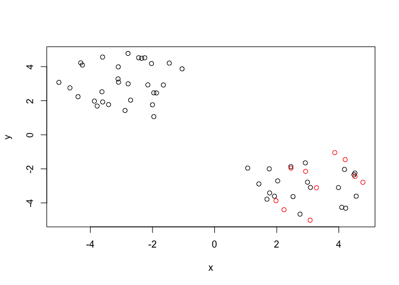

Class 9: Machine Learning pt1.
================
Chae Kook
2/5/2020

## K-means clustering

Let’s try the `kmeans()` function in R to cluster some made-up example
data.

``` r
tmp <- c(rnorm(30,-3), rnorm(30,3)) 
x <- cbind(x=tmp, y=rev(tmp))


plot(x)
```

<!-- --> Use the
kmeans() function setting k to 2 and nstart=20

``` r
km <- kmeans(x, centers = 2, nstart = 20)
```

Inspect/print the results

``` r
km 
```

    ## K-means clustering with 2 clusters of sizes 30, 30
    ## 
    ## Cluster means:
    ##           x         y
    ## 1  3.036064 -3.072001
    ## 2 -3.072001  3.036064
    ## 
    ## Clustering vector:
    ##  [1] 2 2 2 2 2 2 2 2 2 2 2 2 2 2 2 2 2 2 2 2 2 2 2 2 2 2 2 2 2 2 1 1 1 1 1 1 1 1
    ## [39] 1 1 1 1 1 1 1 1 1 1 1 1 1 1 1 1 1 1 1 1 1 1
    ## 
    ## Within cluster sum of squares by cluster:
    ## [1] 62.53523 62.53523
    ##  (between_SS / total_SS =  89.9 %)
    ## 
    ## Available components:
    ## 
    ## [1] "cluster"      "centers"      "totss"        "withinss"     "tot.withinss"
    ## [6] "betweenss"    "size"         "iter"         "ifault"

What is in the output object `km`I can use the `attributes()` function
to find this info

``` r
attributes(km)
```

    ## $names
    ## [1] "cluster"      "centers"      "totss"        "withinss"     "tot.withinss"
    ## [6] "betweenss"    "size"         "iter"         "ifault"      
    ## 
    ## $class
    ## [1] "kmeans"

Q. How many points are in each cluster?

``` r
km$size
```

    ## [1] 30 30

Q. What ‘component’ of your result object details - cluster size? -
cluster assignment/membership? - cluster
    center?

``` r
km$cluster
```

    ##  [1] 2 2 2 2 2 2 2 2 2 2 2 2 2 2 2 2 2 2 2 2 2 2 2 2 2 2 2 2 2 2 1 1 1 1 1 1 1 1
    ## [39] 1 1 1 1 1 1 1 1 1 1 1 1 1 1 1 1 1 1 1 1 1 1

let’s check how many 2s and 1s are in this vector with the `table()`
function.

``` r
table(km$cluster)
```

    ## 
    ##  1  2 
    ## 30 30

Plot x colored by the kmeans cluster assignment and add cluster centers
as blue points

``` r
plot(x, col=km$cluster+1)
points(km$centers, col="blue", pch=15, cex=3)
```

<!-- -->

## Hierarchical clustering in R

The `hclust()` function is the main Hierarchical clustering method in R
and it must be passed a distance matrix as input not your raw data\!

``` r
hc <- hclust( dist(x)) 
hc
```

    ## 
    ## Call:
    ## hclust(d = dist(x))
    ## 
    ## Cluster method   : complete 
    ## Distance         : euclidean 
    ## Number of objects: 60

``` r
plot(hc)
abline(h=6, col="red", lty=2)
```

<!-- -->

``` r
table(cutree(hc, h=3.5))
```

    ## 
    ##  1  2  3  4  5  6 
    ##  5 12 13 12  5 13

You can also ask `cutree()` for the `k` number of groups that you
    want.

``` r
cutree(hc, k=5)
```

    ##  [1] 1 1 1 2 2 2 2 2 1 1 1 1 2 2 2 1 1 1 2 2 2 1 1 1 1 2 2 1 1 1 3 3 4 5 5 3 3 3
    ## [39] 3 5 5 5 3 3 4 5 5 5 3 4 4 3 5 5 5 5 5 3 3 4

### Some more messy data to cluster

``` r
# Step 1. Generate some example data for clustering x <- rbind(
matrix(rnorm(100, mean=0, sd=0.3), ncol = 2) 
```

    ##              [,1]        [,2]
    ##  [1,] -0.31913820 -0.02109787
    ##  [2,]  0.03186402 -0.17957729
    ##  [3,]  0.48375748 -0.20059460
    ##  [4,] -0.39366503 -0.03599685
    ##  [5,]  0.17189445  0.10363401
    ##  [6,]  0.38049361 -0.78180897
    ##  [7,] -0.26561546 -0.07978661
    ##  [8,]  0.49009226 -0.33956113
    ##  [9,] -0.05380197  0.12194989
    ## [10,]  0.04018419 -0.37933969
    ## [11,]  0.15636835  0.28612476
    ## [12,]  0.45929287  0.26465745
    ## [13,] -0.11312212 -0.34511387
    ## [14,] -0.19230680 -0.30733014
    ## [15,] -0.15897707 -0.41035629
    ## [16,]  0.32004260  0.07745656
    ## [17,]  0.42093394 -0.05766921
    ## [18,]  0.09297242 -0.20041143
    ## [19,] -0.47570309  0.38215916
    ## [20,] -0.26339523 -0.01247480
    ## [21,]  0.15354016  0.07124409
    ## [22,]  0.03102017  0.30836894
    ## [23,] -0.16344478 -0.24198403
    ## [24,]  0.21428093 -0.34442785
    ## [25,] -0.09036779 -0.22700342
    ## [26,] -0.08545067 -0.21815372
    ## [27,]  0.31355849 -0.16934805
    ## [28,] -0.47654434 -0.11851911
    ## [29,]  0.82254395  0.23276476
    ## [30,] -0.21233668  0.51116399
    ## [31,]  0.15849475 -0.03676289
    ## [32,]  0.27796116  0.11586018
    ## [33,]  0.25548278  0.32443330
    ## [34,] -0.08018712 -0.38691119
    ## [35,] -0.07343150 -0.23426910
    ## [36,] -0.33359553 -0.54139333
    ## [37,]  0.04255332 -0.19679985
    ## [38,]  0.09926331 -0.11365487
    ## [39,]  0.12991411 -0.32098665
    ## [40,]  0.17023745  0.31840524
    ## [41,]  0.36995024 -0.15544984
    ## [42,]  0.08740956 -0.20408206
    ## [43,]  0.10574367  0.20614899
    ## [44,] -0.10794279 -0.47344302
    ## [45,] -0.07305686  0.15686376
    ## [46,]  0.31398187  0.37838636
    ## [47,]  0.45804409  0.03634850
    ## [48,] -0.23476027  0.67243123
    ## [49,] -0.24874449  0.18886026
    ## [50,]  0.52531739 -0.10457459

``` r
matrix(rnorm(100, mean=1, sd=0.3), ncol = 2)
```

    ##             [,1]      [,2]
    ##  [1,] 1.19760847 1.0236556
    ##  [2,] 1.35353020 0.6939977
    ##  [3,] 0.68572801 0.9837471
    ##  [4,] 0.97918697 1.2747649
    ##  [5,] 1.02626593 1.1727653
    ##  [6,] 1.01187063 0.8429273
    ##  [7,] 1.91437082 0.7830710
    ##  [8,] 0.85247105 0.9378162
    ##  [9,] 1.32216766 1.6258779
    ## [10,] 0.78020704 0.8034727
    ## [11,] 0.06133387 0.8895558
    ## [12,] 1.26367624 1.1246501
    ## [13,] 1.06525507 0.5026807
    ## [14,] 0.74490189 1.5551092
    ## [15,] 1.37747497 0.8756832
    ## [16,] 1.09566883 1.3038572
    ## [17,] 0.76675388 1.6389252
    ## [18,] 1.03829773 0.9966498
    ## [19,] 1.53211294 0.4107839
    ## [20,] 1.42924459 1.0435305
    ## [21,] 0.95570543 1.0215452
    ## [22,] 1.14051846 0.9407165
    ## [23,] 0.81417652 1.0843284
    ## [24,] 0.79282299 0.8253359
    ## [25,] 1.12173334 1.3034469
    ## [26,] 0.99633918 0.9716576
    ## [27,] 1.07928714 1.0502080
    ## [28,] 0.89590916 0.4897840
    ## [29,] 1.35517049 1.2041723
    ## [30,] 1.46361915 1.2716977
    ## [31,] 1.21649065 0.9981566
    ## [32,] 1.09305664 0.9384694
    ## [33,] 0.79526325 0.8198659
    ## [34,] 0.91947846 0.7717310
    ## [35,] 0.80247377 1.1495131
    ## [36,] 1.08620889 0.8326349
    ## [37,] 1.25506859 1.1210930
    ## [38,] 0.99243130 0.6711573
    ## [39,] 0.58812276 0.7849255
    ## [40,] 0.89724998 1.1039184
    ## [41,] 1.35413850 0.8067433
    ## [42,] 1.07471113 1.1669654
    ## [43,] 0.73948463 1.0161904
    ## [44,] 1.22591288 1.0654462
    ## [45,] 0.82859460 1.1410175
    ## [46,] 0.89832546 1.2755583
    ## [47,] 0.58500837 0.7599255
    ## [48,] 1.65454160 1.1778500
    ## [49,] 0.67095172 0.5659507
    ## [50,] 1.17967773 0.9201865

``` r
matrix(c(rnorm(50, mean=1, sd=0.3), rnorm(50, mean=0, sd=0.3)), ncol = 2)
```

    ##            [,1]         [,2]
    ##  [1,] 1.2060488 -0.146109709
    ##  [2,] 1.2034985 -0.014948194
    ##  [3,] 0.9672763 -0.023773402
    ##  [4,] 1.3283526 -0.225318420
    ##  [5,] 1.2297119 -0.287576472
    ##  [6,] 1.1053408  0.087633349
    ##  [7,] 0.8834071  0.160412976
    ##  [8,] 0.7704349  0.150138209
    ##  [9,] 1.2268410 -0.451923138
    ## [10,] 0.9052539 -0.003795535
    ## [11,] 0.4378323  0.224513399
    ## [12,] 1.2743550  0.237776823
    ## [13,] 0.7310799 -0.448243582
    ## [14,] 0.4064599 -0.121512138
    ## [15,] 1.2467844 -0.198130726
    ## [16,] 0.9109003 -0.709841909
    ## [17,] 0.5298332  0.179927805
    ## [18,] 0.6137907 -0.123858665
    ## [19,] 0.7759335 -0.025184663
    ## [20,] 1.4112375  0.228419133
    ## [21,] 0.1586037 -0.157243163
    ## [22,] 0.6289589 -0.468725384
    ## [23,] 1.4528229  0.031413574
    ## [24,] 1.3416974  0.241632278
    ## [25,] 0.5986156  0.365238656
    ## [26,] 1.1364407 -0.259386386
    ## [27,] 1.2382681  0.288933790
    ## [28,] 1.1841891 -0.069463793
    ## [29,] 1.0373119 -0.010029254
    ## [30,] 1.1278636  0.049287480
    ## [31,] 0.7253911 -0.094934302
    ## [32,] 1.1660338 -0.404101019
    ## [33,] 0.7067131  0.223647206
    ## [34,] 0.4787301  0.136608177
    ## [35,] 0.9351139  0.787921847
    ## [36,] 1.0074330  0.081402795
    ## [37,] 0.9142722  0.294574305
    ## [38,] 1.1212339 -0.064383735
    ## [39,] 1.4152264  0.124152783
    ## [40,] 0.9745668  0.274218469
    ## [41,] 0.8907715  0.461178017
    ## [42,] 1.0410321  0.381159279
    ## [43,] 0.8568903 -0.263820048
    ## [44,] 1.2450051  0.326838215
    ## [45,] 0.7252167 -0.007310646
    ## [46,] 0.8536024  0.454468959
    ## [47,] 1.2200001  0.391663072
    ## [48,] 1.8923921  0.179117715
    ## [49,] 0.8387889 -0.157450118
    ## [50,] 1.0057701 -0.216312211

``` r
colnames(x) <- c("x", "y")
# Step 2. Plot the data without clustering
plot(x)
```

<!-- -->

``` r
# c3
 # Step 3. Generate colors for known clusters
# (just so we can compare to hclust results) 
col <- as.factor( rep(c("c1","c2","c3"), each=50) )
plot(x, col=col)
```

<!-- -->

Q. Use the dist(), hclust(), plot() and cutree() functions to return 2
and 3 clusters

``` r
hc <- hclust( dist(x) )
plot(hc)
```

<!-- -->

``` r
grps3 <- cutree(hc, k=3)
grps3
```

    ##  [1] 1 1 1 1 1 1 1 1 1 1 1 1 1 1 1 1 1 1 1 1 1 1 1 1 1 1 1 1 1 1 2 2 2 3 3 2 2 2
    ## [39] 2 3 3 3 2 2 2 3 3 3 2 2 2 2 3 3 3 3 3 2 2 2

``` r
table(grps3)
```

    ## grps3
    ##  1  2  3 
    ## 30 17 13

Q. How does this compare to your known ‘col’ groups?

``` r
plot(x, col=grps3)
```

<!-- -->

# Principal Component Analysis (PCA)

The main function in base R for PCA is called `prcomp()`. Here we will
use PCA to examine the funny food that folks eat in the UK and N.
Ireland.

Import the CSV file first:

``` r
x <- read.csv("UK_foods.csv", row.names=1)
x
```

    ##                     England Wales Scotland N.Ireland
    ## Cheese                  105   103      103        66
    ## Carcass_meat            245   227      242       267
    ## Other_meat              685   803      750       586
    ## Fish                    147   160      122        93
    ## Fats_and_oils           193   235      184       209
    ## Sugars                  156   175      147       139
    ## Fresh_potatoes          720   874      566      1033
    ## Fresh_Veg               253   265      171       143
    ## Other_Veg               488   570      418       355
    ## Processed_potatoes      198   203      220       187
    ## Processed_Veg           360   365      337       334
    ## Fresh_fruit            1102  1137      957       674
    ## Cereals                1472  1582     1462      1494
    ## Beverages                57    73       53        47
    ## Soft_drinks            1374  1256     1572      1506
    ## Alcoholic_drinks        375   475      458       135
    ## Confectionery            54    64       62        41

Make some conventional plots

``` r
barplot(as.matrix(x), beside=T, col=rainbow(nrow(x)))
```

<!-- -->

``` r
pairs(x, col=rainbow(10), pch=16)
```

<!-- -->

\#PCA to the rescue\!

``` r
pca <- prcomp(t(x))
```

``` r
summary(pca)
```

    ## Importance of components:
    ##                             PC1      PC2      PC3       PC4
    ## Standard deviation     324.1502 212.7478 73.87622 4.189e-14
    ## Proportion of Variance   0.6744   0.2905  0.03503 0.000e+00
    ## Cumulative Proportion    0.6744   0.9650  1.00000 1.000e+00

``` r
attributes(pca)
```

    ## $names
    ## [1] "sdev"     "rotation" "center"   "scale"    "x"       
    ## 
    ## $class
    ## [1] "prcomp"

``` r
pca
```

    ## Standard deviations (1, .., p=4):
    ## [1] 3.241502e+02 2.127478e+02 7.387622e+01 4.188568e-14
    ## 
    ## Rotation (n x k) = (17 x 4):
    ##                              PC1          PC2         PC3          PC4
    ## Cheese              -0.056955380 -0.016012850 -0.02394295 -0.691718038
    ## Carcass_meat         0.047927628 -0.013915823 -0.06367111  0.635384915
    ## Other_meat          -0.258916658  0.015331138  0.55384854  0.198175921
    ## Fish                -0.084414983  0.050754947 -0.03906481 -0.015824630
    ## Fats_and_oils       -0.005193623  0.095388656  0.12522257  0.052347444
    ## Sugars              -0.037620983  0.043021699  0.03605745  0.014481347
    ## Fresh_potatoes       0.401402060  0.715017078  0.20668248 -0.151706089
    ## Fresh_Veg           -0.151849942  0.144900268 -0.21382237  0.056182433
    ## Other_Veg           -0.243593729  0.225450923  0.05332841 -0.080722623
    ## Processed_potatoes  -0.026886233 -0.042850761  0.07364902 -0.022618707
    ## Processed_Veg       -0.036488269  0.045451802 -0.05289191  0.009235001
    ## Fresh_fruit         -0.632640898  0.177740743 -0.40012865 -0.021899087
    ## Cereals             -0.047702858  0.212599678  0.35884921  0.084667257
    ## Beverages           -0.026187756  0.030560542  0.04135860 -0.011880823
    ## Soft_drinks          0.232244140 -0.555124311  0.16942648 -0.144367046
    ## Alcoholic_drinks    -0.463968168 -0.113536523  0.49858320 -0.115797605
    ## Confectionery       -0.029650201 -0.005949921  0.05232164 -0.003695024

``` r
plot (pca$x[,1],pca$x[,2], xlab="PC1 (67.4%)", ylab="PC2 (29%)")
text(pca$x[,1],pca$x[,2], labels=colnames(x), col=c("black","red","blue","darkgreen"))
```

<!-- -->

``` r
attributes(pca)
```

    ## $names
    ## [1] "sdev"     "rotation" "center"   "scale"    "x"       
    ## 
    ## $class
    ## [1] "prcomp"
