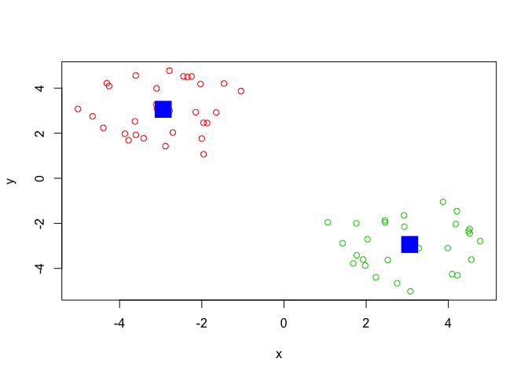

Class 9: Machine Learning pt1.
================
Chae Kook
2/5/2020

## K-means clustering

Let’s try the `kmeans()` function in R to cluster some made-up example
data.

``` r
tmp <- c(rnorm(30,-3), rnorm(30,3)) 
x <- cbind(x=tmp, y=rev(tmp))


plot(x)
```

<!-- --> Use the
kmeans() function setting k to 2 and nstart=20

``` r
km <- kmeans(x, centers = 2, nstart = 20)
```

Inspect/print the results

``` r
km 
```

    ## K-means clustering with 2 clusters of sizes 30, 30
    ## 
    ## Cluster means:
    ##           x         y
    ## 1 -2.809765  2.835469
    ## 2  2.835469 -2.809765
    ## 
    ## Clustering vector:
    ##  [1] 1 1 1 1 1 1 1 1 1 1 1 1 1 1 1 1 1 1 1 1 1 1 1 1 1 1 1 1 1 1 2 2 2 2 2 2 2 2
    ## [39] 2 2 2 2 2 2 2 2 2 2 2 2 2 2 2 2 2 2 2 2 2 2
    ## 
    ## Within cluster sum of squares by cluster:
    ## [1] 49.24177 49.24177
    ##  (between_SS / total_SS =  90.7 %)
    ## 
    ## Available components:
    ## 
    ## [1] "cluster"      "centers"      "totss"        "withinss"     "tot.withinss"
    ## [6] "betweenss"    "size"         "iter"         "ifault"

What is in the output object `km`I can use the `attributes()` function
to find this info

``` r
attributes(km)
```

    ## $names
    ## [1] "cluster"      "centers"      "totss"        "withinss"     "tot.withinss"
    ## [6] "betweenss"    "size"         "iter"         "ifault"      
    ## 
    ## $class
    ## [1] "kmeans"

Q. How many points are in each cluster?

``` r
km$size
```

    ## [1] 30 30

Q. What ‘component’ of your result object details - cluster size? -
cluster assignment/membership? - cluster
    center?

``` r
km$cluster
```

    ##  [1] 1 1 1 1 1 1 1 1 1 1 1 1 1 1 1 1 1 1 1 1 1 1 1 1 1 1 1 1 1 1 2 2 2 2 2 2 2 2
    ## [39] 2 2 2 2 2 2 2 2 2 2 2 2 2 2 2 2 2 2 2 2 2 2

let’s check how many 2s and 1s are in this vector with the `table()`
function.

``` r
table(km$cluster)
```

    ## 
    ##  1  2 
    ## 30 30

Plot x colored by the kmeans cluster assignment and add cluster centers
as blue points

``` r
plot(x, col=km$cluster+1)
points(km$centers, col="blue", pch=15, cex=3)
```

<!-- -->

## Hierarchical clustering in R

The `hclust()` function is the main Hierarchical clustering method in R
and it must be passed a distance matrix as input not your raw data\!

``` r
hc <- hclust( dist(x)) 
hc
```

    ## 
    ## Call:
    ## hclust(d = dist(x))
    ## 
    ## Cluster method   : complete 
    ## Distance         : euclidean 
    ## Number of objects: 60

``` r
plot(hc)
abline(h=6, col="red", lty=2)
```

<!-- -->

``` r
table(cutree(hc, h=3.5))
```

    ## 
    ##  1  2  3  4 
    ## 11 19 19 11

You can also ask `cutree()` for the `k` number of groups that you
    want.

``` r
cutree(hc, k=5)
```

    ##  [1] 1 2 2 1 1 1 2 2 1 1 2 2 1 1 2 1 1 2 1 2 2 2 2 2 2 2 2 2 2 2 3 3 3 3 4 3 3 3
    ## [39] 4 3 4 5 4 5 5 3 5 5 3 3 5 5 3 3 5 5 5 4 3 5

### Some more messy data to cluster

``` r
# Step 1. Generate some example data for clustering x <- rbind(
matrix(rnorm(100, mean=0, sd=0.3), ncol = 2) 
```

    ##               [,1]        [,2]
    ##  [1,]  0.150080453 -0.28476820
    ##  [2,] -0.603896949  0.28337413
    ##  [3,]  0.424932492 -0.21024110
    ##  [4,] -0.032111607 -0.31213169
    ##  [5,]  0.386797173 -0.08347936
    ##  [6,]  0.206604358  0.09430679
    ##  [7,]  0.443720048 -0.17769762
    ##  [8,]  0.299883432  0.07398610
    ##  [9,] -0.239621141 -0.39994694
    ## [10,] -0.183228118 -0.76372481
    ## [11,] -0.420141140  0.08075316
    ## [12,]  0.042051337 -0.34874470
    ## [13,] -0.046375184 -0.02586042
    ## [14,]  0.067790339  0.01099274
    ## [15,] -0.147072442  0.03911988
    ## [16,] -0.384585867  0.19469525
    ## [17,] -0.028972922 -0.15449673
    ## [18,] -0.143186582 -0.16260214
    ## [19,]  0.249516527  0.28287091
    ## [20,]  0.016897490 -0.22215804
    ## [21,] -0.057419054 -0.29402309
    ## [22,] -0.003209871  0.13150335
    ## [23,]  0.406921611  0.04788086
    ## [24,] -0.298646317  0.06277585
    ## [25,]  0.024639637  0.26824655
    ## [26,] -0.623651768  0.25888002
    ## [27,] -0.115484533  0.06503686
    ## [28,] -0.066608092  0.04812480
    ## [29,]  0.126055838  0.05363487
    ## [30,]  0.443115839  0.09904826
    ## [31,] -0.368920886 -0.07336307
    ## [32,] -0.294506628  0.13118253
    ## [33,] -0.214951983  0.11181718
    ## [34,] -0.141094522  0.60154560
    ## [35,]  0.292283672 -0.20035780
    ## [36,]  0.394742004  0.36848203
    ## [37,] -0.180800493  0.41242133
    ## [38,] -0.111401215 -0.02157523
    ## [39,]  0.092142466  0.15737141
    ## [40,] -0.256924639 -0.16160049
    ## [41,] -0.179587970  0.49132441
    ## [42,] -0.073315553  0.13302743
    ## [43,]  0.526545980  0.28985628
    ## [44,]  0.157959734  0.27885468
    ## [45,]  0.262433029  0.17600951
    ## [46,] -0.652838405  0.03197980
    ## [47,] -0.254326129 -0.23337302
    ## [48,]  0.180348718 -0.37473071
    ## [49,]  0.365383588 -0.61118449
    ## [50,] -0.207802620 -0.10252419

``` r
matrix(rnorm(100, mean=1, sd=0.3), ncol = 2)
```

    ##            [,1]       [,2]
    ##  [1,] 1.0797379 1.12179001
    ##  [2,] 0.6130972 0.79239007
    ##  [3,] 0.9093641 1.06021742
    ##  [4,] 1.2325636 1.45710848
    ##  [5,] 0.9852755 0.77395788
    ##  [6,] 0.7314615 1.15725792
    ##  [7,] 0.4793881 1.05935783
    ##  [8,] 1.4034231 1.29958536
    ##  [9,] 0.9691392 1.03957314
    ## [10,] 0.8921242 1.66290657
    ## [11,] 1.0420634 1.19296736
    ## [12,] 0.9805005 0.88785409
    ## [13,] 1.0000411 1.09044095
    ## [14,] 0.1339141 1.13782463
    ## [15,] 0.5940709 0.63979560
    ## [16,] 1.2641480 1.59805408
    ## [17,] 0.7744996 1.56532773
    ## [18,] 0.3889164 0.70573142
    ## [19,] 1.2626744 0.72993020
    ## [20,] 0.9674572 0.68262844
    ## [21,] 1.0481209 0.58263013
    ## [22,] 1.3048328 0.95155488
    ## [23,] 0.8062495 1.25645590
    ## [24,] 0.3339616 0.08791557
    ## [25,] 1.4523330 0.90210894
    ## [26,] 1.3891586 1.02016242
    ## [27,] 1.3824396 1.04457219
    ## [28,] 1.0992625 0.57162830
    ## [29,] 1.1025801 1.09152854
    ## [30,] 0.9484003 1.15874022
    ## [31,] 1.4198334 1.58044149
    ## [32,] 0.5895828 1.35829068
    ## [33,] 0.4930913 0.49560935
    ## [34,] 1.1678514 0.85101198
    ## [35,] 1.0424900 1.64550981
    ## [36,] 0.9371210 1.30137396
    ## [37,] 0.7443900 0.93431910
    ## [38,] 1.5635028 1.26704501
    ## [39,] 1.1000595 1.05576080
    ## [40,] 0.5668551 0.96727615
    ## [41,] 0.9560942 0.61585069
    ## [42,] 0.8378655 0.97801614
    ## [43,] 0.7153903 0.82602590
    ## [44,] 0.7821766 0.99331476
    ## [45,] 0.7594328 1.08897191
    ## [46,] 1.0142457 0.73520635
    ## [47,] 0.5196020 1.47485072
    ## [48,] 0.5202598 0.40108676
    ## [49,] 1.0131172 0.69857492
    ## [50,] 0.7940688 0.95781359

``` r
matrix(c(rnorm(50, mean=1, sd=0.3), rnorm(50, mean=0, sd=0.3)), ncol = 2)
```

    ##            [,1]         [,2]
    ##  [1,] 1.3297029  0.004721177
    ##  [2,] 1.1142857 -0.199959476
    ##  [3,] 0.9728812  0.635480763
    ##  [4,] 1.5504707 -0.402934200
    ##  [5,] 0.9718219 -0.292724459
    ##  [6,] 1.6346800 -0.159824114
    ##  [7,] 1.3958346  0.027409042
    ##  [8,] 0.7869545  0.191523450
    ##  [9,] 0.9693611 -0.062831064
    ## [10,] 0.5946691  0.132331311
    ## [11,] 0.8748505 -0.159228677
    ## [12,] 0.8156601  0.177040929
    ## [13,] 1.1882263 -0.024525765
    ## [14,] 0.4059313 -0.098418771
    ## [15,] 1.1508927  0.331318261
    ## [16,] 0.3214252 -0.479167404
    ## [17,] 0.8352169 -0.136656528
    ## [18,] 0.9336024  0.375101873
    ## [19,] 1.0509913  0.038793120
    ## [20,] 1.0580109 -1.060434219
    ## [21,] 0.2760278  0.302127983
    ## [22,] 0.5954159 -0.050229609
    ## [23,] 0.8052412 -0.002230486
    ## [24,] 0.9932790  0.133616904
    ## [25,] 0.7926407  0.486746779
    ## [26,] 1.2032345  0.166812632
    ## [27,] 1.5825904  0.017770987
    ## [28,] 1.1127898  0.167058573
    ## [29,] 1.0695845 -0.453519228
    ## [30,] 1.3496712 -0.207496402
    ## [31,] 0.5791467  0.384628622
    ## [32,] 1.3759564 -0.047299497
    ## [33,] 0.9474460 -0.239620597
    ## [34,] 0.5804293  0.569672989
    ## [35,] 1.3290170 -0.084325403
    ## [36,] 0.8484450 -0.307426067
    ## [37,] 0.7788671 -0.262351240
    ## [38,] 1.2347472  0.057083351
    ## [39,] 0.7816886  0.195987723
    ## [40,] 0.6042920  0.254345706
    ## [41,] 1.0244461  0.253276429
    ## [42,] 0.7103934 -0.222526041
    ## [43,] 0.9718965 -0.049685311
    ## [44,] 1.2204232  0.049926212
    ## [45,] 0.9580442 -0.081574414
    ## [46,] 0.8503228 -0.698193264
    ## [47,] 0.5105907 -0.094553753
    ## [48,] 1.2775161 -0.124111072
    ## [49,] 0.6305946  0.206141240
    ## [50,] 0.8928370 -0.439069573

``` r
colnames(x) <- c("x", "y")
# Step 2. Plot the data without clustering
plot(x)
```

<!-- -->

``` r
# c3
 # Step 3. Generate colors for known clusters
# (just so we can compare to hclust results) 
col <- as.factor( rep(c("c1","c2","c3"), each=50) )
plot(x, col=col)
```

<!-- -->

Q. Use the dist(), hclust(), plot() and cutree() functions to return 2
and 3 clusters

``` r
hc <- hclust( dist(x) )
plot(hc)
```

<!-- -->

``` r
grps3 <- cutree(hc, k=3)
grps3
```

    ##  [1] 1 1 1 1 1 1 1 1 1 1 1 1 1 1 1 1 1 1 1 1 1 1 1 1 1 1 1 1 1 1 2 2 2 2 2 2 2 2
    ## [39] 2 2 2 3 2 3 3 2 3 3 2 2 3 3 2 2 3 3 3 2 2 3

``` r
table(grps3)
```

    ## grps3
    ##  1  2  3 
    ## 30 19 11

Q. How does this compare to your known ‘col’ groups?

``` r
plot(x, col=grps3)
```

<!-- -->

# Principal Component Analysis (PCA)

The main function in base R for PCA is called `prcomp()`. Here we will
use PCA to examine the funny food that folks eat in the UK and N.
Ireland.

Import the CSV file first:

``` r
x <- read.csv("UK_foods.csv", row.names=1)
x
```

    ##                     England Wales Scotland N.Ireland
    ## Cheese                  105   103      103        66
    ## Carcass_meat            245   227      242       267
    ## Other_meat              685   803      750       586
    ## Fish                    147   160      122        93
    ## Fats_and_oils           193   235      184       209
    ## Sugars                  156   175      147       139
    ## Fresh_potatoes          720   874      566      1033
    ## Fresh_Veg               253   265      171       143
    ## Other_Veg               488   570      418       355
    ## Processed_potatoes      198   203      220       187
    ## Processed_Veg           360   365      337       334
    ## Fresh_fruit            1102  1137      957       674
    ## Cereals                1472  1582     1462      1494
    ## Beverages                57    73       53        47
    ## Soft_drinks            1374  1256     1572      1506
    ## Alcoholic_drinks        375   475      458       135
    ## Confectionery            54    64       62        41

Make some conventional plots

``` r
barplot(as.matrix(x), beside=T, col=rainbow(nrow(x)))
```

<!-- -->

``` r
pairs(x, col=rainbow(10), pch=16)
```

<!-- -->

\#PCA to the rescue\!

``` r
pca <- prcomp(t(x))
```

``` r
summary(pca)
```

    ## Importance of components:
    ##                             PC1      PC2      PC3       PC4
    ## Standard deviation     324.1502 212.7478 73.87622 4.189e-14
    ## Proportion of Variance   0.6744   0.2905  0.03503 0.000e+00
    ## Cumulative Proportion    0.6744   0.9650  1.00000 1.000e+00

``` r
attributes(pca)
```

    ## $names
    ## [1] "sdev"     "rotation" "center"   "scale"    "x"       
    ## 
    ## $class
    ## [1] "prcomp"

``` r
pca
```

    ## Standard deviations (1, .., p=4):
    ## [1] 3.241502e+02 2.127478e+02 7.387622e+01 4.188568e-14
    ## 
    ## Rotation (n x k) = (17 x 4):
    ##                              PC1          PC2         PC3          PC4
    ## Cheese              -0.056955380 -0.016012850 -0.02394295 -0.691718038
    ## Carcass_meat         0.047927628 -0.013915823 -0.06367111  0.635384915
    ## Other_meat          -0.258916658  0.015331138  0.55384854  0.198175921
    ## Fish                -0.084414983  0.050754947 -0.03906481 -0.015824630
    ## Fats_and_oils       -0.005193623  0.095388656  0.12522257  0.052347444
    ## Sugars              -0.037620983  0.043021699  0.03605745  0.014481347
    ## Fresh_potatoes       0.401402060  0.715017078  0.20668248 -0.151706089
    ## Fresh_Veg           -0.151849942  0.144900268 -0.21382237  0.056182433
    ## Other_Veg           -0.243593729  0.225450923  0.05332841 -0.080722623
    ## Processed_potatoes  -0.026886233 -0.042850761  0.07364902 -0.022618707
    ## Processed_Veg       -0.036488269  0.045451802 -0.05289191  0.009235001
    ## Fresh_fruit         -0.632640898  0.177740743 -0.40012865 -0.021899087
    ## Cereals             -0.047702858  0.212599678  0.35884921  0.084667257
    ## Beverages           -0.026187756  0.030560542  0.04135860 -0.011880823
    ## Soft_drinks          0.232244140 -0.555124311  0.16942648 -0.144367046
    ## Alcoholic_drinks    -0.463968168 -0.113536523  0.49858320 -0.115797605
    ## Confectionery       -0.029650201 -0.005949921  0.05232164 -0.003695024

``` r
plot (pca$x[,1],pca$x[,2], xlab="PC1 (67.4%)", ylab="PC2 (29%)")
text(pca$x[,1],pca$x[,2], labels=colnames(x), col=c("black","red","blue","darkgreen"))
```

<!-- -->

``` r
attributes(pca)
```

    ## $names
    ## [1] "sdev"     "rotation" "center"   "scale"    "x"       
    ## 
    ## $class
    ## [1] "prcomp"
